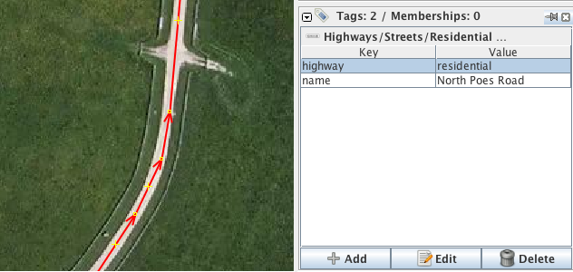
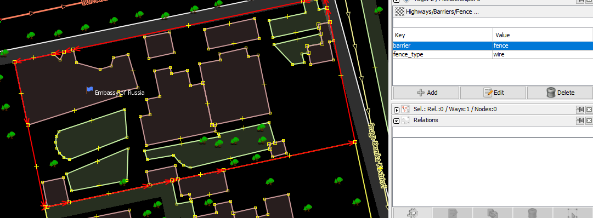
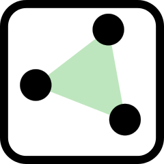
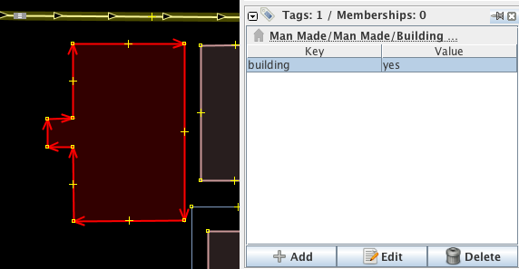
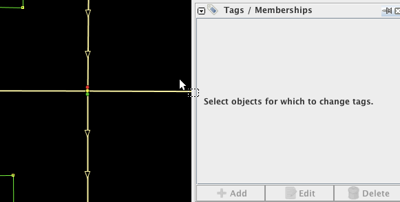

# OSM - JOSM INTRO 
(for n00bs, including me :bowtie: )

#HSLIDE
###1. Pak Histori 

#HSLIDE

#VSLIDE?image=img/ptolemy-map.jpg

#HSLIDE
###2. Banalizim i (objekteve te)botes

#VSLIDE

#VSLIDE

#VSLIDE

#HSLIDE
###2. OSM Data 
1. NODE
2. WAY
3. RELATION

#VSLIDE

#VSLIDE

#VSLIDE

#VSLIDE

#VSLIDE

#HSLIDE
###3. JOSM
